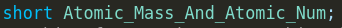

# **Conventions**

# DISCLAIMER ⚠️⚠️⚠️ :

THESE CONVENTIONS ARE NOT UP TO DATE WITH THE CODE ALL THE TIME. IF THE CODE LOOKS DIFFERENT
FROM THE CONVENTIONS, THEN THE CODE TAKES PRIORITY.

## what is this file about?
this file is meant for informing about the conventions that will be used in this software
and all of its code. 🙂

## Atom struct
### How I will use an orbital

Before anything else, lets define an orbital  
When I say orbital, I mean that the orbital exists somewhere in space near the atom(s) and it has a certain size. 
Atomic Orbitals In reality extend out till infinity and there is technically a really astronomically small chance to find an electron of an atom at another galaxy, but it **IS** theoretically possible.

So What do I mean when I say "size of an orbital"? What I mean is the size of the probability field that has a 99% chance of finding an electron inside. That is what actually matters in all chemical reactions. 

### Atomic Mass And Atomic Number

 

this short has 2 bytes, the first 9 bits will define atomic mass, the last 7 bits will define
atomic number

### Atomic Orbitals

