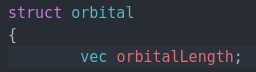

# **Conventions**

## what is this file about?
this file is meant for informing about the conventions that will be used in this software
and all of its code. 🙂

## Orbital struct
### orbital length
  

Before I define the function of this vector, I want us to be on the same page.  
When I say orbital, I mean that the orbital exists somewhere in space near the atom(s) and it has a certain size. 
Atomic Orbitals In reality extend out till infinity and there is technically a really astronomically small chance to 
to find an electron of an atom at another galaxy, but it **IS** theoretically possible.  

So What do I mean when I say "size of an orbital"? What I mean is the size of the probability field that has 
a 99% chance of finding an electron inside. That is what actually matters in all chemical reactions. 
