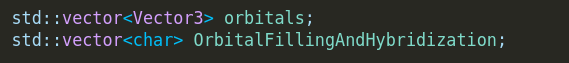

# **Conventions**

## what is this file about?
this file is meant for informing about the conventions that will be used in this software
and all of its code. 🙂

## Atom struct
### How I will use an orbital

Before anything else, lets define an orbital <br>
When I say orbital, I mean that the orbital exists somewhere in space near the atom(s) and it has a certain size.<br>
Atomic Orbitals In reality extend out till infinity and there is technically a really astronomically small chance to find an electron of an atom at another galaxy, but it **IS** theoretically possible.

So What do I mean when I say "size of an orbital"? What I mean is the size of the probability field that has a 99% chance of finding an electron inside. That is what actually matters in all chemical reactions.<br>

### Atomic Mass And Atomic Number

<br>

this short has 2 bytes, the first 9 bits will define atomic mass, the 7 bits will define
atomic number

### Atomic Orbitals



lets talk about the ```std::vector<char> OrbitalFillingAndHybridization``` first.
I am going to assume the char vector as one big datatype, and the first two bits will
represent if i am using molecular orbital theory or valence bond theory

| 00 | Valence bond theory, no hybrid orbitals |
|----|-----------------------------------------|
| 01 | Valence bond theory, hybrid orbitals    |
| 10 | Molecular Orbital theory, no sp mixing  |
| 11 | Molecular Orbital theory, yes sp mixing |


#### if hybrid orbitals enabled (00)
then the next 40 bits are reserved for representing the hybrid orbitals
every 5 bits is a new orbital in hybridization, and the first three tell which shell it is
like the 1 shell, the 2 shell, the 3 shell, etc. in binary, 11 = 3, 100 = 5, like that
the other two bits tell the orbital<br>

| 00 | s orbital |
|----|-----------|
| 01 | p orbital |
| 10 | d orbital |
| 11 | f orbital |

all the orbitals in the 40 bits are having same energy state and hence in hybridization

for example, 10110 represents 5d, 01100 represents 3s orbital

the subsequent bits except the last 7 (which i will tell later on in the documentation) will 
represent the number of electrons in each orbital in the interval of every 2 bits

| 00 | no electrons |
|----|--------------|
| 01 | 1 electron   |
| 10 | 2 electrons  |


#### if hybrid orbitals disabled (01)
the next 40 bits (given that they exist, since the number of bits can be lesser without hybridization) <br>
will not represent hybridization but rather the number of electrons in the orbital, in intervals of 2 bits,<br>
similar to if the hybrid orbitals were enabled.

#### Molecular Orbital Theory
I will ***MAYBE*** implement this later, big ***MAYBE***

#### the orbital vector3's vector


The first orbital in this list is NOT NECESSARILY the 1s orbital, it can ofcourse be the 1s orbital <br>
and for atoms such as hydrogen, helium, lithium & berrylium.

but for atoms such as uranium, the configuration is \[Rn\] 5f³ 6d¹ 7s² here
the configuration starts with Radon, which brings us to the next point

the last 7 bits will be for telling the atomic number of the configuration <br>
of the closest noble gas <font size="2">(though it doesnt have to be a noble gas, <br>
it can be any other elements configuration, i have usually observed noble gases used, also try only inputting noble gases, anything else may not work, especially the f block elements which are weirdly filled, it will give incorrect filling and i am NOT going to write code to do additional checks) </font> that is
put in the square brackets [ ].

for example, Carbon would be \[He\] 2s² 2p², and the last 7 bits would be 0000010 representing helium.

now to the actual vector of orbitals


```std::vector<Vector3> orbitals```<br><br>

this vector of Vector3's (please try not to be confused between c++ std::vector
and the mathematical vector, <br> the std::vector is like an array, but mathematical vector is the Vector3 class)<br>

the s orbitals will require only 1 Vector3, same the the p<font size=1>x</font>, p<font size=1>y</font>, p<font size=1>z</font>

but the d<font size=1>xy</font>, d<font size=1>yz</font>, d<font size=1>xz</font>, d<font size=1>x²-y²</font> 
(but not the d<font size=1>z²</font>) requires 2 Vector3's.