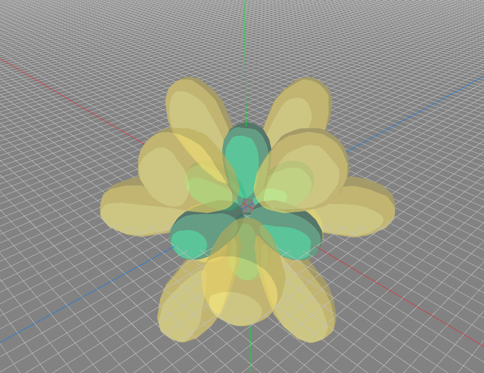

#  Welcome to IB Molecule Viewer


## What is IB Molecule Viewer?  

IB = my initials

This program is Meant to show the structure of molecules and compounds, the main focus being organic molecules but coordination compounds will also be supported eventually if i am not too lazy to implement it.


##  How to Run It

  
Currently only ***Linux*** is Supported, but you can easily just edit the *Makefile* to include the libraries for ***windows*** or ***mac OS*** (stop using mac os, linux is better)

### LINUX

To run the program, you have to first install the [raylib libraries](https://github.com/raysan5/raylib/wiki/Working-on-GNU-Linux), this will install the required dependencies on your system.

Next Open the command line on your system and clone the repository using the git tool, execute the following command:
```bash
git clone https://github.com/ishaan-bose/IB-Molecule-Viewer.git
```
next go inside the Directory of the repository:
```bash
cd IB_Molecule_Viewer/
```

To build the program, simply type the make command:
```bash
make all
```

Hopefully everything builds correctly, if you face any error, post an issue or figure it out yourself, you probably didnt install all the libraries correctly

To simply run the program without building it, in the console execute the following:
```bash
make run
```

And to clean the build, simply do the following in the console:
```bash
make clean
```


## Convention.md Disclaimer

the Convention.md file may be lagging behind the actual code, because I write the code first THEN i update the Conventions. There may be entire chunks of code rewritten therefore be careful and if there is a conflict between code and Conventions, the code takes priority.
  

##  Progress

  

Right Now there isn't much to show, this image shows a model of the p and d orbitals that has some basic cel shading applied to it

  



  

##  Plans for this project in the future:


1.  Using the Atom class make a function to iterate through each atom and render it

2.  Using the vector that represents the orbital to appropriately rotate the orbitals, for more information look at the [Convention.md](https://github.com/ishaan-bose/IB-Molecule-Viewer/blob/main/Conventions%20And%20Usage/Convention.md) file

3.  Add a simple GUI using the raygui library.

4.  Implement a way to edit the atom's position and rotation using the GUI

5.  Add a simple Raycaster that will allow you to select an atom or an orbital by highlighting it (changing material to a brighter version)

6.  Add different Rendering Modes, they are mainly "**BALL AND STICK**" mode and "**ORBITAL**" mode and "**MIXED**" mode

*  BALL AND STICK mode will show the bonds as stick and atoms as balls

*  ORBITAL mode will show each orbital of the bond

*  MIXED mode will show both, the orbitals will be transparent

7.  Speaking of bonds, need to create a bond struct that has atom id's in them to show which two atoms are bonded, it will also store information on the orbitals of each atom involved as well as a variable to store established and partial bonds (for transition states as well as resonance). I also need to create atom id's, will probably be a short as I don't want more than 65,536 atoms in the project

8.  Create a Mechanism to Create a bond, then another mechanism to delete a bond. **Deleting**: First it will call a method on each of its atom's to unhybridize the bond if it is hybridized, then based on the parameters of bond breaking, it will give the electrons to the atom that is set as the receiving atom, or it might give an electron to both (homolytic bond cleavage) or it might delete the electrons (for example in an S<sub>N<sup>2</sup></sub> reaction, a new bond with 2 new electrons will be created using a partial bond, then in the next step it will delete the electrons of the bond of the leaving group)

9.  Implement a way to store the atoms and bonds in a custom file type, as stated earlier,

the number of atoms will be limited to 65536, biologists and their ultra big proteins can go fuck themselves, and the program itself will only load 300 atoms at a time

10.  create a struct called **moondrecool** (inspired from the words molecule, moon, dracula and cool, it has nothing to do with the moon or dracula, very little to do with the words cool and has something to do with molecule), this is just a collection of everything in the project, wether it be a bunch of different molecules, a bunch of different atoms and molecules, just a bunch of different atoms not bonded at all, a single atom, a sigle molecule, molecules that are extremely unstable, molecules in their transition states, it doesnt matter. it just stores will all similar to a file.

Infact the file will store stuff as moondrecools.

11.  Implement a Reaction Editor, which will have a tree like structure. The reactions will start off with one moondrecool and you have the ability to make it branch out into different other moondrecools (you would want to do this if a reaction has both a major and minor product, or multiple products such as multiple stereoisomers, or into multiple transition states) or just into another moondrecool
